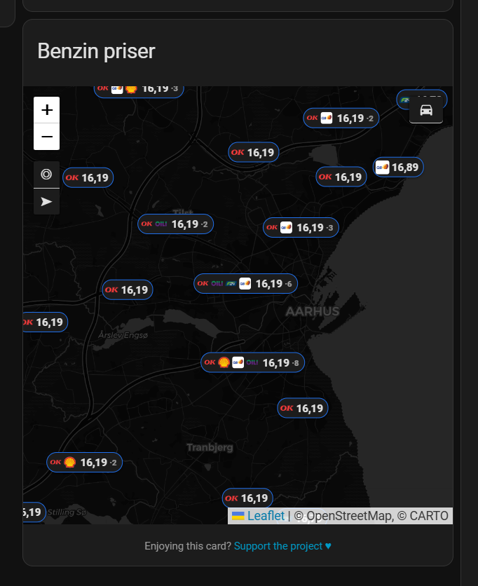
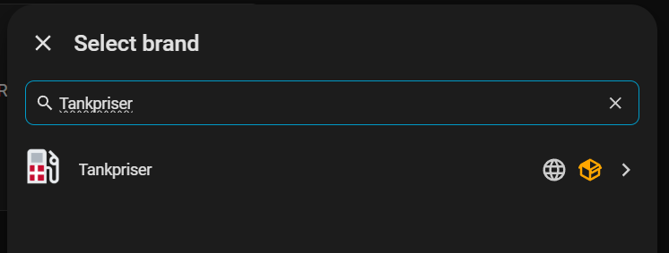
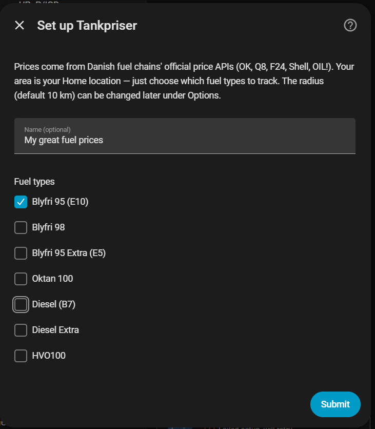

# Tankpriser for Home Assistant

[](https://hacs.xyz/)
[](https://www.home-assistant.io/)
[](LICENSE)

Danish fuel prices — **Blyfri 95/98, Diesel, HVO100 and more** — on your Home
Assistant dashboard, on a map, in your car and in Siri. Prices come straight
from the **official per-station price APIs** that Danish fuel chains are
required to publish (OK, Q8, F24, Shell and OIL! today), with no scraping, no
account and no API key. Geographic filtering uses the free
[DAWA](https://dawadocs.dataforsyningen.dk/) address API.

Two different scopes, worth knowing up front:

- The **sensors** — cheapest price, station list, notifications — cover **your
  Home Assistant Home location plus a radius you choose**. Nothing to look up,
  nothing to paste in.
- The **map card** is not tied to that radius. Out of the box it plots **every
  station in Denmark** and the *viewport* is the filter: pan or zoom out and you
  see the rest of the country, zoom in and clusters break apart. Set
  `coverage: area` if you want the map to stay inside your radius too.

  

> ℹ️ **Petrol and diesel only.** Electricity/EV charging prices are not
> included — no Danish charge-point operator publishes an open price feed that I know of (If you know where I can get the data from then let me know and and I will try to inclide it).
> Chains appear here as they start complying with the 2026 price-transparency
> law; adding one is a small change ([how to add a chain](docs/IMPLEMENTATION.md#add-a-fuel-chain)).

**Contents**

1. [Features](#features)
2. [Requirements](#requirements)
3. [Installation](#installation)
4. [First-time setup](#first-time-setup)
5. [Configuration](#configuration) — one section per feature
6. [Entities and attributes](#entities-and-attributes)
7. [Services, events and diagnostics](#services-events-and-diagnostics)
8. [Troubleshooting](#troubleshooting)
9. [Privacy and data sources](#privacy-and-data-sources)
10. [Screenshots to capture](#screenshots-to-capture)
11. [For developers](#for-developers)

---

## Features

What each feature *is*. How to switch it on is in
[Configuration](#configuration), one section per feature, in the same order.

| # | Feature | In short |
| --- | --- | --- |
| 1 | [Local price sensors](#1-local-price-sensors) | Cheapest price per fuel around Home, full station list in attributes |
| 2 | [Hidden stations](#2-hidden-stations) | Exclude forecourts you would never use |
| 3 | [Loyalty discounts](#3-loyalty-discounts) | Every price becomes *what you actually pay* |
| 4 | [Price-change notifications](#4-price-change-notifications) | Four rules, to any `notify.*` service |
| 5 | [The price card](#5-the-price-card) | Bundled Lovelace card, no YAML or resource setup |
| 6 | [The map](#6-the-map) | Every station with chain icon and price — all of Denmark by default, the viewport is the filter |
| 7 | [Live position and follow-me](#7-live-position-and-follow-me) | A blue dot that keeps up with you while driving |
| 8 | [Navigate here](#8-navigate-here) | Hand a forecourt to the phone's own navigator |
| 9 | [Exact forecourt positions](#9-exact-forecourt-positions) | Street addresses geocoded, estimates marked as estimates |
| 10 | [Cars on the map](#10-cars-on-the-map) | Your cars plotted, ringed by fuel level, hideable per device |
| 11 | [In the car: CarPlay, Siri, Android Auto](#11-in-the-car-carplay-siri-and-android-auto) | A "cheapest nearby" sensor built for voice and car screens |
| 12 | [Fuel-consumption prediction](#12-fuel-consumption-prediction) | When each car next needs refuelling, learned from its fuel level |
| 13 | [Chains that need an API key](#13-chains-that-need-an-api-key) | A guided page for chains that are not open (none today) |

### 1. Local price sensors

One sensor per fuel type you select. Its **state is the cheapest price** in your
area; its attributes carry **every station** in range with price, address,
coordinates and when the chain last changed that price, plus `average_price`,
`station_count` and `cheapest_station`.

Seven fuels are modelled: **Blyfri 95 (E10)**, **Blyfri 98**, **Blyfri 95 Extra
(E5)**, **Oktan 100**, **Diesel (B7)**, **Diesel Extra** and **HVO100**. Which
ones exist near you depends on the chains around you — OK sells Oktan 100, Q8
and F24 sell HVO100, and so on.

The area is your **Home location** and a radius of 5–50 km. Prices refresh every
30 minutes by default (minimum 15). A chain that stops answering keeps serving
its last good response for at most 6 hours and then **drops out of the list
entirely** — a stale price with nothing on screen saying so is worse than a
missing one.

### 2. Hidden stations

Some forecourts you will never use — the one behind a motorway junction you
cannot reach, or a chain you refuse on principle. Hidden stations disappear from
the list, the map and the cheapest-of calculation, so the number on your
dashboard is a price you would actually drive to.

### 3. Loyalty discounts

Set your fuel card's discount per chain in **øre per litre** — the unit the
cards themselves advertise — and from then on **every** price in the integration
is what you pay. The cheapest-of, the notifications, the sensors, the map and
the in-car sensors all agree, and none of them has to know discounts exist. The
card still shows the pump price beside it (a `−20` badge in the list, *"Pumpepris
16,99 · din rabat 20 øre"* in the popup) so you can see why the forecourt sign
says something else.

### 4. Price-change notifications

After each refresh the integration compares the new prices with the previous
snapshot and can send a notification to any `notify.*` service. Four rules:

| Rule                                              | Fires when                                                    |
| --------------------------------------------------| ------------------------------------------------------------- |
| Any price change in the area                      | *any* station's price for a tracked fuel moved                |
| When the cheapest price changes                   | the cheapest price moved, up or down                          |
| When the cheapest price drops below the threshold | it crosses your threshold downwards (once, not every refresh) |
| Only when the cheapest price decreases            | good news only                                                |

Every successful refresh also fires a `tankpriser_price_updated` event you can
build your own automations on.

### 5. The price card

A Lovelace card ships **inside the integration**: no HACS frontend repository,
no `resources:` entry, no YAML. It registers itself and appears in the card
picker as **"Tankpriser Prices"**, with a **visual editor** that offers only the
options that currently do something — switch the map off and the map settings
step out of the way.

Without the map it is a compact price table — station, town, distance, price,
cheapest highlighted — that makes **no external network request at all**. It
repaints when the integration says there is new data, not on a timer of its own.

Each row says **how far away** the station is. Measured from your live position
when the map is already tracking it, and from your Home location otherwise; the
section header says which of the two, because "3,2 km" means something different
from the car than from the house. On a phone with the map and position dot on,
the distances follow you as you drive. Nothing new is asked of the browser: a
card that never had permission to know where you are still measures from Home.

The order is **cheapest first**. Set `sort: distance` for nearest first, or
`show_distance: false` to leave distances out altogether.

### 6. The map

Turn the map on and every station becomes a marker showing **its chain's icon
and its price**. Nearby stations group into a cluster labelled with the **lowest
price inside it** and which chains it holds; tap a station for all its fuels and
when the chain last changed them.

**The map has its own coverage, independent of the sensor radius.** Two settings:

- **`national`** — the default. *Every* Danish station for one fuel, with the
  **map viewport as the filter**: pan to another part of the country and its
  stations are there, zoom out and they aggregate into clusters. Your configured
  radius does not apply here at all. The list is fetched on demand over a
  websocket rather than stuffed into a sensor attribute, so ~1200 stations never
  touch the state machine.
- **`area`** — restrict the map to the same Home location + radius the sensors
  use, so the map and the price table below it always agree.

Leaflet and all chain icons are served by Home Assistant itself, so the map
works on a LAN with no internet. The one exception is the **background tiles**,
which your browser fetches from OpenStreetMap (or CARTO in dark mode) — see
[Privacy](#privacy-and-data-sources).

### 7. Live position and follow-me

A blue dot shows **where you are**, and keeps moving as you do. Two buttons sit
under the zoom controls:

- **◎** — recentre on you once, then leave the map alone.
- **➤** — *follow me*: recentre on every new fix, so the map keeps pace with you
  in the car. **Off by default**; it turns solid blue when armed, and panning by
  hand switches it back off.

The GPS watch only runs while the card is on screen, and only asks for
high-accuracy fixes while follow-me is armed. If location is unavailable —
denied, or Home Assistant served over plain `http`, where browsers disable
geolocation — the dot never appears and ◎ falls back to your Home location.

### 8. Navigate here

Every station popup offers **➤ Navigér hertil**, which hands the position to
whatever navigator the device has: on Android the system chooser (Google Maps,
Waze, whatever is installed), on iPhone/iPad Apple Maps, on a computer Google
Maps in a new tab. You can pin one, or remove the link entirely.

### 9. Exact forecourt positions

Chains that ship no coordinates (Q8 and F24) get their **street address geocoded
against DAWA**, so their markers sit on the real forecourt rather than a
postnummer centre — all 241 of them when last measured. Results are cached and
re-verified every 180 days.

A handful of stations still cannot be placed exactly — a motorway plaza with no
street address, typically. Those keep a dashed `≈` pin, say in the popup that
the position is only estimated, and get **no navigate button**. Sending an
estimate to a navigator looks authoritative and puts you in the wrong place,
which is worse than not offering it.

### 10. Cars on the map

If a car you configured for [prediction](#12-fuel-consumption-prediction)
reports coordinates (a `device_tracker`, typically), it is plotted on the map
too, **ringed by fuel level — green when full, red when empty** — with the
percentage on the marker. Cars draw above station pins, so a car is never buried
under a forecourt. Two cars parked in the same place group into one marker
showing both faces; tap it and they spread apart. A car with no photo gets
Material Design's `mdi:car`, inlined, in the theme's own text colour.

**Hiding a car, just for you.** A dashboard is shared by everyone who can see
it, so the card config cannot hold a per-person choice. The car button lists every
car with a checkbox, and a car's own popup has *"Skjul denne bil her"*. That
choice is remembered on **that device, for that Home Assistant user** — your
phone can show only your car while your partner's phone shows only theirs, from
one shared dashboard. The button reads `2/3` whenever something is hidden, so a
filter is never silent.

### 11. In the car: CarPlay, Siri and Android Auto

Neither CarPlay nor Android Auto lets Home Assistant draw a map, so the card
cannot appear there. Instead, nominate a device (your phone, or the car itself)
and you get a **`…_cheapest_nearby` sensor per fuel**: stations within a radius
of *that device*, cheapest first, each with its distance.

These rank against **every station in Denmark**, not the area your price sensors
cover — the point is the device, which drives out of that area. Halfway to the
next town you are offered the forecourts halfway to the next town.

- **Android Auto** shows the sensor's price while driving, and — because the
  sensor carries the cheapest station's latitude/longitude — can **navigate
  straight to it**.
- **Siri** can read out the three cheapest and navigate to the one you name. Ask
  *"billigste benzin"*, hear *"Nummer 1: Q8 Virum, 16,79 kroner, 1,2
  kilometer…"*, say *"nummer to"*, and Google Maps starts the route on the
  CarPlay screen. The sentence is pre-built in the `spoken` attribute, in Home
  Assistant's own language, so the Shortcut is one action instead of a Jinja
  loop.

The sensors re-rank when the device *moves*, not only on the price poll — and
only write state when the ranking actually changed, so a driving phone does not
flood the recorder.

The Siri route is **confirmed working on CarPlay** (2026-07-26): asked by name,
three stations read out, chosen by number, route started on the car screen. It
does depend on a handful of iPhone settings — see
[11a, setting up your iPhone](#11a-setting-up-your-iphone).

### 12. Fuel-consumption prediction

Tankpriser predicts **when each of your cars will next need refuelling**,
learned entirely from a fuel-level entity Home Assistant already has. It is
**free** — a donation is genuinely appreciated, but nothing is ever withheld.

Each car gets a **`sensor.<car>_days_until_refuel`** with attributes for
consumption, confidence, the predicted empty date, current level, and the
cheapest nearby station for its fuel. It answers in three stages, so you are not
waiting weeks for the first number:

| `status`     | State                        | When |
| ------------ | ---------------------------- | ---- |
| `learning`   | `unknown`                    | Right after adding the car. It needs real driving — at least **3 days** and at least **5 % of the tank** gone — before it will guess. A car sitting on the drive tells it nothing. |
| `estimating` | a number, shown as `~9 days` | From the tank you are on now, or one completed tank. Rough; confidence capped at 0.3, and it moves as it learns. |
| `ready`      | a number                     | Two or more completed tanks (i.e. two refuels) back it up. |

**If you drive irregularly** — hard some days, not at all on others — this still
works, and the arithmetic is built around it. A completed tank already averages
your busy and quiet days together, which is why two of them count as `ready`.
The tank in progress is folded in continuously, so the estimate tracks a change
in your habits within days rather than waiting for your next fill-up, but it is
weighted by *how much time it covers*: one busy Saturday nudges the number, it
does not take it over.

With an **odometer** the prediction is in **L/100 km**; without one it falls
back to a time-based rate. A second bundled card, **"Tankpriser Prediction"**,
shows it as a tank gauge with the details.

### 13. Chains that need an API key

Most Danish chains publish openly and need no setup. If a chain is added that
only answers with a personal key, it appears under **Chains & API keys** with a
step-by-step guide to requesting one; the key is validated immediately, stored
in the config entry, sent only to that chain and redacted from diagnostics.
**Today no supported chain needs a key, so this menu entry is hidden.**

### Also included

- **Danish and English UI** — every dialog, error and option is translated, and
  the spoken sentence for Siri follows Home Assistant's own language.
- **Redacted diagnostics** and two maintenance services — see
  [Services, events and diagnostics](#services-events-and-diagnostics).

---

## Requirements

- **Home Assistant 2025.2.0** or newer.
- Your **Home location** set under *Settings → System → General* — it is the
  centre of the sensors' search area. Without it the sensors stay empty (the
  national map still works, since it does not use the radius).
- Internet access from Home Assistant (the chains' APIs and DAWA). No account,
  no API key, no `configuration.yaml` entry.
- Optional, for [prediction](#12-fuel-consumption-prediction): an entity that
  reports a car's fuel level.

## Installation

**Via HACS (recommended)**

1. HACS → **⋮** → **Custom repositories** → add
   `https://github.com/laithsaid/ha-tankpriser` as category **Integration**.
2. Install **Tankpriser**, then **restart Home Assistant**.

**Manually**

1. Copy `custom_components/tankpriser/` into your `config/custom_components/`.
2. Restart Home Assistant.

The dashboard cards are installed with the integration — there is nothing to add
to your Lovelace resources.

## First-time setup

1. **Settings → Devices & Services → Add Integration → Tankpriser**.

   

2. Optionally give it a **name** (it becomes the device name and the notification
   title), and pick the **fuel types** to track. Blyfri 95 and Diesel are
   preselected.

   

3. Submit. That is the whole setup — the area comes from your Home location and
   the radius defaults to 10 km. Sensors appear within a few seconds.

Everything else is under **Configure** on the integration card, or on the card
in your dashboard. Read on.

---

## Configuration

The numbered sections below match the numbered features above, one for one.
Where the settings live:

| Where | What you can change there |
| --- | --- |
| **Settings → Devices & Services → Tankpriser → Configure** | Radius, fuel types, hidden stations, update interval, nearby device, discounts, notifications, chain API keys |
| **… → Tankpriser → Add car** | A car for consumption prediction (as many as you like) |
| **Your dashboard → Add card** | The price card and the prediction card, with visual editors |

<!-- 📸 SCREENSHOT S04 options-menu.png — the Configure menu showing "Area & fuel types", "Loyalty discounts" and "Price notifications" -->

### 1. Choosing your area, fuels and refresh rate

*([what this feature does](#1-local-price-sensors))*

**Configure → Area & fuel types.**

| Field | Notes |
| --- | --- |
| **Radius around Home** | 5 / 10 / 15 / 25 / 50 km. Bigger areas cost nothing extra — the chains are fetched nationwide either way and filtered locally. |
| **Fuel types** | One sensor is created per fuel. Removing a fuel removes its sensor. |
| **Update interval (minutes)** | Default 30, minimum 15. Chains change prices roughly daily, so there is little to gain below that. |

<!-- 📸 SCREENSHOT S05 options-settings.png — the "Area & fuel types" form, all fields visible -->

> If no stations appear, check your Home location first — see
> [Troubleshooting](#troubleshooting).

### 2. Hiding stations

*([what this feature does](#2-hidden-stations))*

**Configure → Area & fuel types → Hide these stations.** The dropdown lists the
stations currently discovered in your area; pick any number of them. Names you
type by hand are accepted too, which is how you pre-hide a station that is
temporarily missing from the feed. Hidden stations leave the list, the map and
the cheapest-of calculation at once.

### 3. Setting your loyalty discounts

*([what this feature does](#3-loyalty-discounts))*

**Configure → Loyalty discounts.** One field per chain — OIL!, F24, Q8, Shell,
Circle K / INGO, Go'on, Uno-X, OK — in **øre per litre**. Leave a chain at `0`
if you have no card for it. Maximum 200 øre/L; anything larger is a kroner value
typed into an øre field and would invent a negative price.

<!-- 📸 SCREENSHOT S06 options-discounts.png — the "Loyalty discounts" form with one or two chains filled in -->

The change applies on the next refresh, everywhere at once.

### 4. Turning on price notifications

*([what this feature does](#4-price-change-notifications))*

**Configure → Price notifications.**

| Field | Notes |
| --- | --- |
| **Send notifications on price changes** | The master switch. |
| **Notify service** | A dropdown of your `notify.*` services, e.g. `notify.mobile_app_pixel`. Only `notify.*` is ever called. |
| **When to notify** | One of the four rules in [feature 4](#4-price-change-notifications). |
| **Price threshold** | Only used by the "below threshold" rule, in kr./L, e.g. `16.50`. |

<!-- 📸 SCREENSHOT S07 options-notifications.png — the "Price notifications" form with a rule selected -->
<!-- 📸 SCREENSHOT S08 notification-phone.png — the resulting notification on a phone (optional but nice) -->

The message is one line per fuel that fired, e.g.
`Diesel (B7): cheapest 15,79 → 15,49 ↓`, titled with the integration's name.

### 5. Adding the price card

*([what this feature does](#5-the-price-card))*

Edit a dashboard → **Add card** → search **"Tankpriser Prices"**. The visual
editor covers every option; the YAML below is only for reference.

<!-- 📸 SCREENSHOT S09 card-picker.png — the card picker with "Tankpriser" searched, both cards visible -->
<!-- 📸 SCREENSHOT S10 card-editor.png — the visual editor for the price card -->

A plain price list:

```yaml
type: custom:tankpriser-card
title: Fuel near home
entities:
  - sensor.tankpriser_blyfri_95_e10
  - sensor.tankpriser_diesel_b7
```

<!-- 📸 SCREENSHOT S11 card-list.png — the card with show_map off: the price table, cheapest highlighted, a discount badge if you have one -->

**All card options:**

| Option | Default | Description |
| --- | --- | --- |
| `entity` / `entities` | — | One or more Tankpriser price sensors. Required unless `fuel` is set |
| `fuel` | from the entity | Which fuel the map shows (`blyfri95`, `diesel`, `hvo100`, …) |
| `title` | none | Card header |
| `show_map` | `false` | Show the map above the list |
| `map_height` | `420` | Map height in px |
| `map_theme` | `auto` | `auto` (follows the HA theme) / `light` / `dark` |
| `coverage` | `national` | `area` = Home location + configured radius; `national` = all DK stations, viewport is the filter |
| `cluster` | `true` | Group nearby stations into clusters |
| `show_list` | shown only when the map is off | Set `true` to show map *and* table |
| `highlight_cheapest` | `true` | Emphasise the cheapest row |
| `max_stations` | `0` (all) | Cap the number of rows in the table |
| `show_distance` | `true` | How far away each station is, above its price. Measured from your live position when the map is tracking it, otherwise from Home — the header says which |
| `sort` | `price` | `price` = cheapest first; `distance` = nearest first |
| `show_my_location` | `true` | Live GPS dot and the ◎ / ➤ buttons. `false` removes all three and never asks for your location |
| `follow_me` | `false` | Start with follow-me armed |
| `show_cars` | `true` | Plot your configured cars on the map |
| `cars` | auto-detect | Explicit list of `…_days_until_refuel` entities to plot |
| `car_picker` | `true` | The 🚗 button: hide/show cars **on this device only** |
| `navigation` | `auto` | `auto` / `geo` / `apple` / `google` / `osm` / `off` |

### 6. Turning on the map

*([what this feature does](#6-the-map))*

Set `show_map: true` (or tick it in the editor). Coverage defaults to
`national` — all of Denmark, filtered by what you have panned to.

Area map — pinned to the same radius as the sensors, with the table underneath:

```yaml
type: custom:tankpriser-card
show_map: true
coverage: area
show_list: true
entities:
  - sensor.tankpriser_blyfri_95_e10
```

<!-- 📸 SCREENSHOT S12 card-map-area.png — area map, a few chain-icon markers with prices, one cluster -->

Full national map — all Danish stations for one fuel. Use a **Panel** view so it
gets the full width:

```yaml
type: custom:tankpriser-card
show_map: true
coverage: national
map_theme: dark
entities:
  - sensor.tankpriser_blyfri_95_e10   # the fuel to show nationwide
```

<!-- 📸 SCREENSHOT S13 card-map-national.png — zoomed out over Denmark, clusters showing the lowest price in each -->
<!-- 📸 SCREENSHOT S14 station-popup.png — one station popup open: all its fuels, the "last changed" line, the ➤ Navigér hertil button, and a discount line if configured -->

To keep every request local, set `show_map: false` — the price table needs no
external request at all.

### 7. Position and follow-me

*([what this feature does](#7-live-position-and-follow-me))*

Nothing to configure: the dot and the ◎ / ➤ buttons are on whenever the map is.

- Start with follow-me armed: `follow_me: true`.
- Turn the whole thing off: `show_my_location: false` removes the dot, both
  buttons and the GPS watch, so nothing on the card can ask for your position.

**Home Assistant must be served over HTTPS** (or `localhost`) for this to work —
browsers refuse geolocation on plain `http`.

<!-- 📸 SCREENSHOT S15 map-controls.png — close-up of the ◎ and ➤ buttons with the blue position dot, follow-me armed (solid blue) -->

### 8. Choosing a navigator

*([what this feature does](#8-navigate-here))*

On by default. To force one navigator for everyone, set `navigation` to `geo`
(Android chooser), `apple`, `google` or `osm`; `navigation: off` removes the
button. Stations with an estimated position never get one, whatever you set.

### 9. Forecourt positions

*([what this feature does](#9-exact-forecourt-positions))*

Nothing to configure — geocoding runs by itself and caches its results. If a
station you know is showing a dashed `≈` pin, its chain publishes no coordinates
*and* DAWA could not match its address; please
[open an issue](https://github.com/laithsaid/ha-tankpriser/issues) with the
station name.

### 10. Showing your cars on the map

*([what this feature does](#10-cars-on-the-map))*

Add a car first (see [§12 below](#12-adding-a-car-for-prediction)); if its
source entity reports coordinates, it appears on the map automatically.

- Turn cars off for this card: `show_cars: false`.
- Plot only specific cars for everyone: `cars: [sensor.passat_days_until_refuel]`.
- Remove the per-device 🚗 filter button: `car_picker: false`.

<!-- 📸 SCREENSHOT S16 car-marker.png — a car marker ringed by fuel level with the 🚗 picker open showing the checkboxes -->

### 11. Setting up the in-car sensors

*([what this feature does](#11-in-the-car-carplay-siri-and-android-auto))*

**Configure → Area & fuel types**, two fields:

| Field | Notes |
| --- | --- |
| **Rank stations near this device (phone or car)** | A `device_tracker`, `person` or `sensor` that carries latitude/longitude. Leave empty and the nearby sensors are not created at all. |
| **How far to look for nearby stations** | 1–100 km, default 15. |

You then get one `sensor.…_cheapest_nearby` per fuel:

```
sensor.tankpriser_blyfri_95_e10_cheapest_nearby
  state: 16.79                    ← what you pay, discounts included
  attributes:
    cheapest_station: "Q8 Hummeltoftevej 45"
    distance_km: 1.2
    latitude / longitude          ← only when the position is exact
    station_count: 23             ← how many are in range
    spoken_cheapest: "Billigste er Q8 Hummeltoftevej, 16,79 kroner, 1,2 kilometer væk."
    spoken: "Nummer 1: Q8 Hummeltoftevej, 16,79 kroner, 1,2 kilometer. …"
    stations: [ {name, company, city, price, distance_km, …}, … ]
    origin_latitude / origin_longitude   ← where this was measured from
    origin_source: "tracker"             ← or "zone:home", or "none"
    position_updated: "2026-07-26T14:03:11+02:00"
```

> **Copy your own entity id before using the templates below.** Home Assistant
> builds it from the *area name* you chose, so it is `sensor.tankpriser_…` only
> if you kept the default — name the area "Silkeborg" and it becomes
> `sensor.silkeborg_blyfri_95_e10_cheapest_nearby`. **Developer tools →
> States**, filter `cheapest_nearby`, and copy what is actually there.

**Android Auto needs nothing more.** Parked, open the companion app →
**Settings → Companion app → Android Auto favorites** and add the sensor.
Android Auto renders sensor states in its driving list, and offers navigation to
any entity carrying a location — which this one does, pointing at the cheapest
nearby forecourt. Your `…_days_until_refuel` sensors work as favourites too.

**iPhone takes more work**, because Apple does not let an integration install a
Shortcut for you. The rest of this section is that: phone settings first, then
the shortcut, built once in about five minutes.

#### 11a. Setting up your iPhone

Six settings decide whether any of this works in a car. None is obvious, and
each fails quietly in its own way — the sensor keeps answering, just about the
wrong place, or Siri stops mid-sentence. Set them before building anything.

| Setting | Where | Why it matters |
| --- | --- | --- |
| **Location: Always** | Settings → Home Assistant → Location | A Shortcut runs the app in the *background*. On "While Using the App" iOS refuses it a position, so Home Assistant keeps the one from when you last opened the app — usually your driveway. Everything then answers confidently about the town you left. |
| **Precise Location: on** | same screen | Without it iOS reports a coarse area, and "the cheapest station within 10 km" stops meaning anything. |
| **Background App Refresh: on** | Settings → Home Assistant | Lets the app send a position and answer a Shortcut without being open. |
| **Never force-quit Home Assistant** | the App Switcher | Swiping the app away tells iOS not to background-launch it again until you open it by hand. Every Home Assistant action in a Shortcut then fails, with Siri saying only *"something went wrong"*. Open it once after a phone restart and leave it alone. |
| **Siri Responses: Prefer Spoken** | Settings → Siri & Search → Siri Responses | On the default *Automatic*, Siri **prints** her answer whenever the ring switch is silent. A shortcut whose whole point is being heard then does nothing useful. |
| **Siri language** | Settings → Siri & Search → Language | Your shortcut's *name* must be words in this language. A Danish name spoken to an English Siri transcribes as nonsense, matches nothing, and gets web-searched instead. |

Two of these — Location: Always, and not force-quitting the app — are the
difference between a shortcut that works in the car and one that fails in ways
nothing on screen explains.

<!-- 📸 SCREENSHOT S17 nearby-sensor.png — Developer Tools → States showing a _cheapest_nearby sensor with its `spoken` and `stations` attributes -->

Two more things that are easy to assume otherwise:

- **Shortcuts has no CarPlay screen.** You cannot build, edit or even see
  shortcuts on the car display; in the car, voice is the only way to run one.
  Apple's design, not a limit of this integration.
- **The Home Assistant actions live inside Shortcuts**, not the other way round.
  Where a step says *search "Home Assistant"*, you are searching the Shortcuts
  action picker. They are there because the app is installed and signed in on
  that same iPhone — you never open the HA app while building this.

The **Shortcuts app is Apple's and comes with iOS** — a dark icon with two
overlapping rounded squares. Swipe down on the home screen and type `Shortcuts`.
If it is missing it was deleted at some point; reinstall it free.

Also have **Google Maps** installed (Apple Maps works too — see 11e).

#### 11b. The shortcut — six actions

One shortcut, one behaviour: you ask, it names the cheapest station near you,
says it is taking you there, and starts the route. Nothing to choose, no number
to say, no prompt to answer — in a moving car the shortest useful exchange is
the right one.

1. On the **iPhone**, open **Shortcuts** and tap **+** for a new, empty one.
2. Tap its name at the top → **Rename** → **Billigste benzin**. *This is the
   phrase you will say to Siri*, so pick something you pronounce cleanly and
   that sounds unlike your other shortcuts. It must be words in **Siri's own
   language**. On an English Siri, call it *Cheap fuel*.
3. **Add action** → search `Home Assistant` → **Update location**.
   Then **Add action** → search `Wait` → **Wait**, set to **2 seconds**.

   *Why these first: Update location forces a fresh GPS fix and sends it, so the
   answer describes where you are and not where the app last checked in; the
   wait gives it time to arrive before the next step reads the sensor. Skip them
   and the phone can still be reporting your driveway while you are 20 km down
   the road — and it will name the station at home, distance and all, with no
   hint anything is wrong.*
4. **Add action** → search `Home Assistant` → **Render template**. It appears
   with two fields: **Server** (leave it) and **Template**, pre-filled with
   Apple's `{{ now() }}`. Select that, delete it, and paste this — with your own
   entity id:

   ```jinja
   {{ states.sensor.tankpriser_blyfri_95_e10_cheapest_nearby.attributes.spoken_cheapest }} Jeg sætter kurs mod den nu.
   ```

   The first part is a finished sentence built by the integration — *"Billigste
   er OK Nordre Ringvej, 16,19 kroner, 1,9 kilometer væk."* — in your **Home
   Assistant** language, with the house number dropped (unusable when heard) and
   a Danish decimal comma, so "16,19" is read as sixteen nineteen rather than
   "sixteen point one nine". The words after it are plain text: **change them to
   whatever you want announced**, or delete them if you would rather it just
   read the station and go.

   **Danish or English is decided by Home Assistant, not by the iPhone.** The
   sentence is built server-side, so it follows the **system** language under
   *Settings → System → General → Language*. On an English Home Assistant you
   get "kilometres" and a decimal point — *"16.19"*, which Siri reads as "sixteen
   point one nine" — and it sounds odd next to a Danish shortcut name. Set the
   system language to **Dansk** and it becomes *"Billigste er …, 16,19 kroner,
   1,9 kilometer væk."* Your own interface language is separate, in your user
   profile, so the dashboard can stay in English if you prefer it that way.

   **There is not a single quote mark in it, deliberately.** The obvious way to
   write this uses `state_attr('sensor.…', 'spoken_cheapest')` — and a template
   copied through a phone, a note app or a chat window comes out with `'` turned
   into a curly `'`, which Jinja cannot parse. The dotted form above has nothing
   to curl, so it survives being copied anywhere.

   > **Try it in Home Assistant before pasting it into Shortcuts.** *Developer
   > tools → Template*, paste it in, read the result pane. That one step splits
   > every later problem in half:
   >
   > | Result pane | Meaning |
   > | --- | --- |
   > | The sentence | The template is right. Anything that fails afterwards is the shortcut or the app, not this. |
   > | A red error mentioning `has no attribute` | The entity id is wrong. It follows your **area name**, so an area called "Silkeborg" gives `sensor.silkeborg_blyfri_95_e10_cheapest_nearby`. Copy it from *Developer tools → States*. |
   > | A red error about the template syntax | The text itself, and almost always **smart quotes** from copying it through something that curls them. The version above avoids quotes entirely — retype it by hand rather than pasting a curled copy. |
   > | Nothing but your own trailing words | `spoken_cheapest` is missing, which means a version before 0.12.0b6. Redownload in HACS and restart. |
5. **Add action** → search `Speak` → **Speak Text**. Tap its text field and pick
   **Render template** from the variable bar above the keyboard. Expand it (tap
   ⌄) and turn **Wait Until Finished** on.

   That switch is what makes the shortcut wait for her to finish the sentence.
   Without it, opening the map takes the audio and cuts her off mid-word.
6. **Add action** → **Render template** again. Clear its `{{ now() }}` and paste
   this. It returns the route to that same station:

   ```jinja
   
   https://www.google.com/maps/dir/?api=1&destination={{ s[0].latitude }},{{ s[0].longitude }}
   ```

   The `-` in `` is load-bearing: without it the tag leaves its newline
   behind and the action returns a blank line followed by the URL.
7. **Add action** → search `Open URLs` → **Open URLs**.

   Take Apple's plain **Open URLs**, *not* "Open URLs in Chrome" or any other
   app's version — a browser would open the link as a **web page**, and browsers
   are not CarPlay apps, so nothing would reach the car screen.

   Its input must be the **second** Render template, the one returning the URL.
   Already showing a `Render template` chip? Leave it — Shortcuts fills in the
   action directly above, which is the right one. Empty? Tap the field and pick
   it from the variable bar. Getting a **"Select Variable"** list? It is asking
   *which* earlier result, not for a name you invent: two entries are called
   *Render template*, and you want the **lower** one.
8. **Done.** The finished order is: Update location → Wait → Render template →
   Speak Text → Render template → Open URLs.

**Test it parked, on the phone.** Say *"Hey Siri, Billigste benzin"* with the
engine off: it should name one station and open Google Maps to it.

**Then test it in the car.** Connect CarPlay, press the **voice button on the
steering wheel**, say the name. The Shortcuts app never appears on the CarPlay
screen — voice is the only trigger.

<!-- 📸 SCREENSHOT S18 (optional) siri-shortcut.png — the finished Shortcut, or a photo of the CarPlay screen -->

#### 11c. When it does not work

| What happens | Why, and what to do |
| --- | --- |
| Siri: *"something went wrong"*, and the Home Assistant app was not running | Every Home Assistant action here belongs to that app, and iOS stops background-launching an app you have **force-quit** (swiped away in the App Switcher) until you open it by hand. A phone restart does the same until the first launch. Open Home Assistant once, leave it in the background, and check Background App Refresh is on. **Adding an "Open App" action does not fix this** — tested in a car: Siri opens the app and the shortcut stops there, because handing the foreground to another app ends the run. |
| Siri starts saying something, gets cut off, and the map opens | **Wait Until Finished** is off on the Speak Text. Expand the action with ⌄ and turn it on — that is what makes the shortcut hold until she is done. |
| Siri: *"I don't see an app for that"* | The shortcut name is being misheard. Rename it to something more distinct and say it exactly. |
| Siri web-searches the phrase instead of running anything | She could not match what she heard to any shortcut. Almost always a language mismatch: **Settings → Siri & Search → Language**. Either set Siri to Dansk, or rename the shortcut to words in Siri's language. Saying *"kør \<name\>"* also helps her treat it as a shortcut rather than a query. |
| It shows the text instead of reading it aloud | Not the shortcut — **Siri Responses** is on *Automatic*, so she prints whenever the ring switch is silent. Set **Prefer Spoken Responses** (11a). |
| It runs, spins, then ends silently — no speech, no map | A **Dictate Text** action, left over from an older version of this guide. Siri holds the microphone for the whole run, so it waits for audio that never arrives. Delete it; nothing here needs it. |
| *"Ingen stationer i nærheden"* | No station within the radius, or the tracked device has no position. Check `station_count`, `tracked_entity`, `radius_km` on the sensor. |
| Speaks nothing at all | The entity id in the template is wrong — it follows your **area name**. Copy it from Developer tools → States. |
| A template action returns a date/time | Apple's default `{{ now() }}` was left in place — clear the field completely before pasting. |
| Speaks, then nothing happens | Google Maps is not installed, or that station has no exact coordinates (approximate positions are deliberately omitted rather than sending you to a postnummer centre). Try the Apple Maps variant below. |
| A web page opens instead of the map app | "Open URLs **in Chrome**" was used instead of Apple's plain **Open URLs**. |
| Nothing opens, and the spoken sentence appeared as a URL | **Open URLs** is pointing at the *first* Render template. Point it at the lower one. |
| **You are already navigating somewhere, and nothing happens** | Expected, and not fixable from a shortcut — see 11d. |
| It names a station in the town you *left* | The phone has not reported its position recently, so the ranking was measured from wherever it last checked in. Check **Location: Always** (11a) and that **Update location** + **Wait** are the first two actions. To confirm after the fact, read `origin_latitude` / `origin_longitude` / `position_updated` on the sensor. The station list is nationwide, so a wrong town can only come from a wrong position. |

#### 11d. Already navigating? What that can and cannot do

If Google Maps (or Apple Maps) is **already running a route**, the shortcut
cannot slip a fuel stop into it. That is not a limitation of this integration,
and there is no way round it from a shortcut:

- iOS tells nothing — not Shortcuts, not us — **where you are currently being
  navigated to**. So even a route rebuilt as "station first, then destination"
  has no destination to put second.
- Neither Maps app has a URL that means *"add a stop to the route you are on"*.
  A maps link starts a **new** route, which is why an active navigation either
  ignores it or offers to replace what you were doing.

What does work while navigating is the map app's own feature: in **Google
Maps**, tap the **magnifying glass → Gas stations** with a route running and it
lists them along your way, adding one as a stop without losing your destination.
It will not know your prices or your loyalty discounts, so the useful pairing is
to **ask Tankpriser first, then pick that chain in Maps**.

Simplest of all: if you know you will want fuel, run the shortcut *before* you
start the route. It takes you to the pump; you set your real destination after.

#### 11e. Variants

Small edits to the one shortcut, if you want them:

- **Apple Maps instead of Google:** in the URL template, swap the link for
  `http://maps.apple.com/?daddr={{ s.latitude }},{{ s.longitude }}&dirflg=d`.
- **A different fuel:** point both templates at that fuel's sensor, e.g.
  `sensor.tankpriser_diesel_b7_cheapest_nearby`. A second shortcut with its own
  name gives you one per fuel.
- **Just tell me, do not navigate:** delete actions 6 and 7 (the URL template
  and Open URLs), and drop the *"Jeg sætter kurs mod den nu"* wording from the
  first template. This variant also works as a saved **Assist prompt** in
  CarPlay's Quick Access tab.
- **Say so when the position is old.** The one failure you cannot hear is a
  confident answer about the town you left. This speaks a warning first when the
  phone has not reported for five minutes, and is otherwise identical:

  ```jinja
  
  
  
  Bemærk: positionen er {{ minutes }} minutter gammel. 
  {{- sensor.attributes.spoken_cheapest }} Jeg sætter kurs mod den nu.
  ```

- **Name three and let you choose one.** The sensor also carries `spoken`, which
  names the three cheapest with distances, and `stations` holds all of them.
  Building a shortcut that asks which one you want takes four more actions and
  an **Ask for Input**. It is deliberately not documented here: one station and a
  route is the version that works while driving.

**Verified in a car, 2026-07-26.**

### 12. Adding a car for prediction

*([what this feature does](#12-fuel-consumption-prediction))*

**Settings → Devices & Services → Tankpriser → Add car.** Add as many as you
like.

| Field | Notes |
| --- | --- |
| **Car name** | Becomes the device name and the entity id. |
| **Fuel-level entity** | Any entity that reports the level — a sensor, or e.g. a car `device_tracker`. |
| **Level attribute** (optional) | Leave empty to use the entity's state. Otherwise the attribute, e.g. `fuel_level`. Nested paths use dots: `data.fuel.level`. |
| **Level is measured in** | Percent of tank, or litres. |
| **Tank capacity (litres)** | Turns a percentage into litres and estimates range. |
| **Odometer entity** (optional) | With one, the prediction is in L/100 km; without one, time-based. |
| **Odometer attribute** (optional) | As above — empty means the odometer entity's state. |
| **Fuel type** | Which fuel this car uses, so it can show the cheapest nearby price for it. |

<!-- 📸 SCREENSHOT S19 add-car.png — the "Add a car" form filled in -->

Editing a car later: the car appears as a sub-item on the Tankpriser device
page with its own **Edit** button. Changing the tank size is a good moment to
run [`tankpriser.reset_history`](#services-events-and-diagnostics).

**The prediction card:** Add card → **"Tankpriser Prediction"**. Pick your cars
in the editor's *"Which cars"* field — it lists only cars, and takes **as many as
you like**. Added from the picker it starts with all of them.

```yaml
type: custom:tankpriser-prediction-card
entities:
  - sensor.passat_days_until_refuel
  - sensor.polo_days_until_refuel
```

Each car gets its own block, named, with its own gauge and figures; the donation
ask appears once for the whole card rather than once per car. With a **single**
car the card titles itself with that car's name and the block heading is
dropped, so nothing is said twice:

```yaml
type: custom:tankpriser-prediction-card
entity: sensor.passat_days_until_refuel   # the single-car form still works
title: Passat            # optional; defaults to the car's own name, "" for none
```

Prefer one card per car — different dashboard positions, or a card each in
separate columns? That still works; add the card once per car.

<!-- 📸 SCREENSHOT S20 prediction-card.png — the prediction card with the tank gauge, ideally in "ready" state -->

### 13. Entering a chain API key

*([what this feature does](#13-chains-that-need-an-api-key))*

**Configure → Chains & API keys** — the menu entry only appears when a supported
chain actually needs one, which today none does. When it does, pick the chain,
follow the guide shown in the dialog, paste the key (it is checked immediately)
and save. Clearing the field removes the key and stops using that chain.

---

## Entities and attributes

Entity ids below assume the default name "Tankpriser"; if you named the
integration something else, that name is used instead.

### `sensor.tankpriser_<fuel>` — one per tracked fuel

**State:** the cheapest price in your area, in kr./L.

| Attribute | Meaning |
| --- | --- |
| `stations` | Every station in range: `name`, `company`, `address`, `city`, `postnummer`, `price`, `list_price`, `discount_ore`, `updated`, `latitude`, `longitude`, `coord_approx` |
| `cheapest_station`, `cheapest_price` | The winner |
| `average_price` | Mean across the area |
| `station_count` | How many stations sell this fuel here |
| `discounted` | `true` if any price here has one of your loyalty discounts applied |
| `area`, `radius`, `fuel_type`, `fuel_key` | What this sensor covers |

### `sensor.tankpriser_<fuel>_cheapest_nearby` — only when a device is nominated

**State:** the cheapest price within the nearby radius of that device.

| Attribute | Meaning |
| --- | --- |
| `stations` | Up to 8, cheapest first, each with `distance_km` |
| `spoken_cheapest` | The **single** cheapest as a ready-to-speak sentence, in HA's language — what the documented Siri shortcut reads out |
| `spoken` | The three cheapest as a ready-to-speak sentence, for a shortcut that lets you choose |
| `cheapest_station`, `cheapest_price`, `distance_km` | The winner |
| `latitude`, `longitude` | The winner's position — **this is what Android Auto navigates to**. Omitted when the position is only estimated |
| `station_count` / `listed_count` | How many are in range / how many are listed above |
| `tracked_entity`, `radius_km` | What "nearby" means here |
| `origin_latitude`, `origin_longitude`, `origin_source` | The position this ranking was measured from, and where it came from: `tracker` (the device's own coordinates), `zone:home` (it reported a zone instead), or `none` |
| `position_updated` | When that device last told Home Assistant anything. If it is old, so is the answer — see [11c, when it does not work](#11c-when-it-does-not-work) |

### `sensor.<car>_days_until_refuel` — one per car

**State:** days until the tank is empty, or `unknown` while learning.

| Attribute | Meaning |
| --- | --- |
| `status` | `learning` / `estimating` / `ready` |
| `current_level_l`, `current_level_percent`, `tank_capacity_l` | Where the tank is now |
| `avg_consumption`, `consumption_unit`, `method`, `basis` | What it learned and how |
| `learned_tanks`, `confidence` | How much it has to go on (0–1) |
| `predicted_empty` | ISO timestamp |
| `cheapest_station`, `cheapest_price` | For this car's fuel, in your area |
| `latitude`, `longitude`, `car_picture` | Present when the source entity supplies them — this is what puts the car on the map |
| `source_entity`, `level_attribute`, `odometer_entity` | Exactly which config is in use, for debugging |

<!-- 📸 SCREENSHOT S21 device-page.png — the Tankpriser device page listing the sensors and the car sub-entries -->

## Services, events and diagnostics

| Service | What it does |
| --- | --- |
| `tankpriser.nearby` | The cheapest stations around a position **you supply**, returned directly to the caller — a spoken sentence, the ranked stations, and one navigation URL per station. No entity, no device tracker, nothing that can be stale in between. Fields: `latitude`, `longitude` (both required), `fuel`, `radius_km`, `maps`. Returns `spoken_cheapest`, `spoken`, `stations` and `urls`. For automations that announce prices unprompted — and for a Shortcut built on Apple's *Get contents of URL* and a long-lived token, which needs no Home Assistant app at all. |
| `tankpriser.seed_demo_history` | Injects synthetic tanks into a car so the prediction shows a number immediately. For testing and demos — **it overwrites learned history**. Fields: `car` (blank = all), `tanks`, `litres_per_day`, `days_per_tank` |
| `tankpriser.reset_history` | Clears a car's learned history, returning it to `learning`. Use after changing the tank size, or to undo a demo seed. Field: `car` (blank = all) |

| Event | Payload |
| --- | --- |
| `tankpriser_price_updated` | `entry_id`, `area`, `radius`, `station_count` — fired after every successful refresh |

**Diagnostics:** the integration's ⋮ → *Download diagnostics* gives the entry
config, the resolved area and the current station data. API keys, the
integration's name and your notify service are redacted; attach it to a bug
report as-is.

## Troubleshooting

| Symptom | Likely cause and fix |
| --- | --- |
| Sensors have no stations | **Home location not set** (*Settings → System → General*), or your radius is small and rural. The log says `No HA Home location set` in that case. The map is unaffected in `national` coverage — it does not use the radius. |
| The map shows stations far outside my radius | That is `coverage: national`, the default: the viewport is the filter, not your radius. Set `coverage: area` to pin it. |
| A chain you expect is missing | Only OK, Q8, F24, Shell and OIL! publish open APIs today. A chain that fails for more than 6 hours also drops out on purpose rather than showing stale prices. |
| The card says "Configuration error" | A browser holding an old `index.html`. Fully close and reopen the HA app, or hard-refresh the browser. The card is also registered as a Lovelace resource, which fixes this on the next dashboard open. |
| The map is blank/grey but markers show | The background tiles are blocked (no internet, or a DNS/ad blocker). The prices are unaffected; `show_map: false` removes the dependency. |
| No blue position dot | HA served over plain `http`, or location permission denied for the site. Browsers disable geolocation on `http`. |
| A station has a dashed `≈` pin and no navigate button | Its position is only estimated — deliberately not handed to a navigator. |
| No `…_cheapest_nearby` sensors | No device nominated under *Configure → Area & fuel types*, or the entity you chose carries no latitude/longitude. |
| `…_cheapest_nearby` names stations in the town you left | The nominated device has not reported its position recently, so the answer was measured from wherever it last checked in. The candidates are nationwide, so a wrong town means a wrong position: check `origin_latitude` / `origin_longitude` / `position_updated` on the sensor. For Siri, [11c](#11c-when-it-does-not-work) has the fix. |
| Card distances measured from the wrong place | With no live position the card measures from Home — the header says `from home`. It switches to `from you` only once the map's position dot has a fix, which needs HTTPS and permission. |
| Prediction stuck on `learning` | It needs ≥ 3 days *and* ≥ 5 % of the tank consumed. A parked car never leaves this state. `tankpriser.seed_demo_history` shows what the card looks like meanwhile. |
| Prediction looks wrong after changing tank size | Run `tankpriser.reset_history` for that car. |
| Notifications never arrive | Check the notify service exists (*Developer Tools → Actions*), and remember the "below threshold" rule fires on the *crossing*, not on every refresh. |

More depth — logs, installing a build by hand, running the test suite — is in
[`docs/TESTING.md`](docs/TESTING.md).

## Privacy and data sources

- **Prices** come from each chain's own public API: OK, Q8/F24, Shell and OIL!.
  Each is fetched nationwide, cached for 10 minutes and shared by everything in
  the integration, so a shorter poll interval does not multiply requests. The
  User-Agent identifies this integration honestly, with a link, rather than
  impersonating a browser.
- **Geography** comes from [DAWA](https://dawadocs.dataforsyningen.dk/) — free,
  keyless, run by the Danish state — for postnummer/radius resolution and for
  geocoding station addresses. Geocodes are cached for 180 days.
- **Nothing about you is sent anywhere.** No account, no telemetry, no
  third-party analytics. Your position never leaves the browser: the blue dot is
  drawn locally.
- **The one external request your browser makes** is for map tiles, from
  OpenStreetMap (or CARTO in dark mode). Those reveal your IP and roughly which
  area you are looking at. `show_map: false` removes them; everything else,
  including the chain icons and Leaflet itself, is served by Home Assistant.

## Screenshots to capture

S01–S03 are done. For the rest, put the file in **`docs/images/`** under the name
below; each remaining spot in this README carries a matching
`<!-- 📸 SCREENSHOT Sxx … -->` comment — replace that comment with an
`` line.

| # | File | Capture | Goes in |
| --- | --- | --- | --- |
| ✅ S01 | `hero-card.png` | The price card with the map on, a few stations, cheapest highlighted | Top of README |
| ✅ S02 | `add-integration.png` | "Add integration" dialog, "Tankpriser" searched | First-time setup, step 1 |
| ✅ S03 | `setup-fuel-types.png` | The setup dialog: name field + fuel-type list | First-time setup, step 2 |
| S04 | `options-menu.png` | The Configure menu and its entries | Configuration, intro |
| S05 | `options-settings.png` | "Area & fuel types" form, all fields | Configuration §1 |
| S06 | `options-discounts.png` | "Loyalty discounts" form, a chain or two filled in | Configuration §3 |
| S07 | `options-notifications.png` | "Price notifications" form with a rule chosen | Configuration §4 |
| S08 | `notification-phone.png` | The resulting phone notification *(optional)* | Configuration §4 |
| S09 | `card-picker.png` | Card picker with "Tankpriser" searched, both cards | Configuration §5 |
| S10 | `card-editor.png` | The price card's visual editor | Configuration §5 |
| S11 | `card-list.png` | The card with the map off: price table + discount badge | Configuration §5 |
| S12 | `card-map-area.png` | Area map: chain-icon markers with prices, one cluster | Configuration §6 |
| S13 | `card-map-national.png` | Zoomed out over Denmark, clusters showing lowest prices | Configuration §6 |
| S14 | `station-popup.png` | A station popup: fuels, last-changed, ➤ Navigér hertil | Configuration §6 |
| S15 | `map-controls.png` | Close-up: blue dot, ◎ and ➤ (armed, solid blue) | Configuration §7 |
| S16 | `car-marker.png` | Car marker ringed by fuel level, 🚗 picker open | Configuration §10 |
| S17 | `nearby-sensor.png` | Developer Tools → States, a `_cheapest_nearby` sensor with `spoken` | Configuration §11 |
| S18 | `siri-shortcut.png` | The finished Shortcut, or the CarPlay screen *(optional)* | Section 11c |
| S19 | `add-car.png` | The "Add a car" form, filled in | Configuration §12 |
| S20 | `prediction-card.png` | Prediction card with the tank gauge, ideally `ready` | Configuration §12 |
| S21 | `device-page.png` | The Tankpriser device page: sensors + car sub-entries | Entities and attributes |

Tips: use one theme throughout (light reads best in a README), capture at a
**desktop width of ~1000 px** — dialogs are narrow anyway — and before
committing, check S05, S17 and S21 for a house number, a plate or a device name
you would rather not publish.

## For developers

- [`docs/ARCHITECTURE.md`](docs/ARCHITECTURE.md) — how the pieces fit together:
  the price-aggregation and consumption-prediction subsystems, data flow,
  caching and external dependencies.
- [`docs/IMPLEMENTATION.md`](docs/IMPLEMENTATION.md) — a guide to reading the
  code: entry points, three end-to-end walkthroughs (a price refresh, a car's
  level changing, the card painting the map), the data contracts between
  layers, a per-module reference, the prediction algorithm, storage schemas,
  how to extend it, and a "where to look if…" table.
- [`docs/TESTING.md`](docs/TESTING.md) — installing a build in a real Home
  Assistant, verifying it, running the test suite, and a troubleshooting table.

Bugs and chain requests: [issues](https://github.com/laithsaid/ha-tankpriser/issues).

## Support

Tankpriser is free and open source, prediction included. If it saves you money,
a donation is genuinely appreciated: **[paypal.me/tankpriser](https://paypal.me/tankpriser)**.

The same link sits in both cards' footers, always. It is one line, it withholds
nothing, and it is the only thing the project asks in return — so there is no
card option to hide it or to point it elsewhere. Forking? Change `DONATE_URL` in
`const.py` (and the copy at the top of `www/tankpriser-card.js`).

## Disclaimer

Prices come directly from each fuel chain's public price API and may be delayed
or inaccurate; the forecourt sign wins. This project is not affiliated with any
fuel chain. Use responsibly and keep the polling interval reasonable.

Licensed under the [MIT License](LICENSE).
